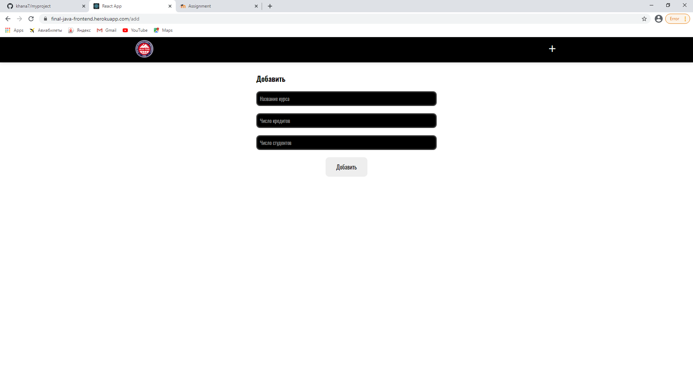

# web

 
 We dont have a trello but we do this work 
 
  front end:
  
  
  1 Preparing the react application
  
  
  2 Standard layout
  
  
  3 connecting api
  
  
  4 fill in heroku
  
  
  backend:
  
  
  1 Writing Models
  
  
  2 Writing Controllers
  
  
  3 Postgres connection
  
  
  4 fill in heroku
  
  
  sweager:
  
  
  1 connecting to sweager 
  
  also you can check
  
  1 Backend: https://final-java-backend.herokuapp.com/api/main
  2 Swagger: https://final-java-backend.herokuapp.com/swagger-ui.html#/

YouTube link: https://youtu.be/0DPalpjV5YU

